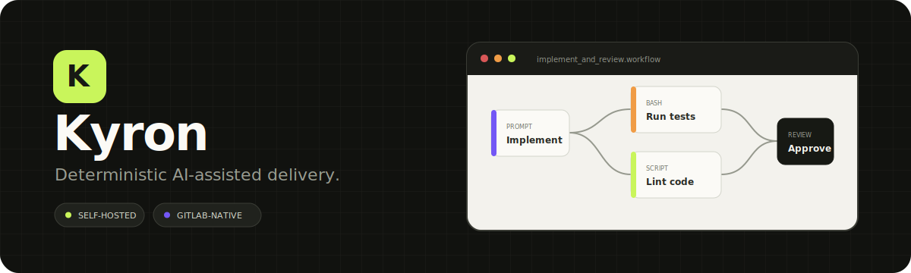
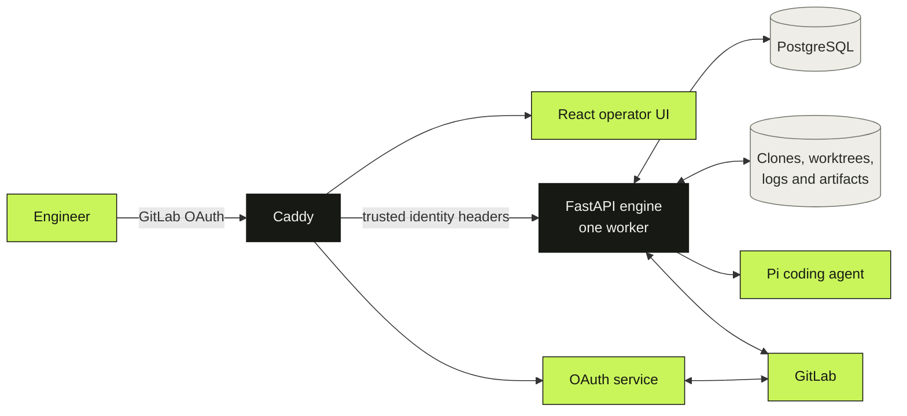
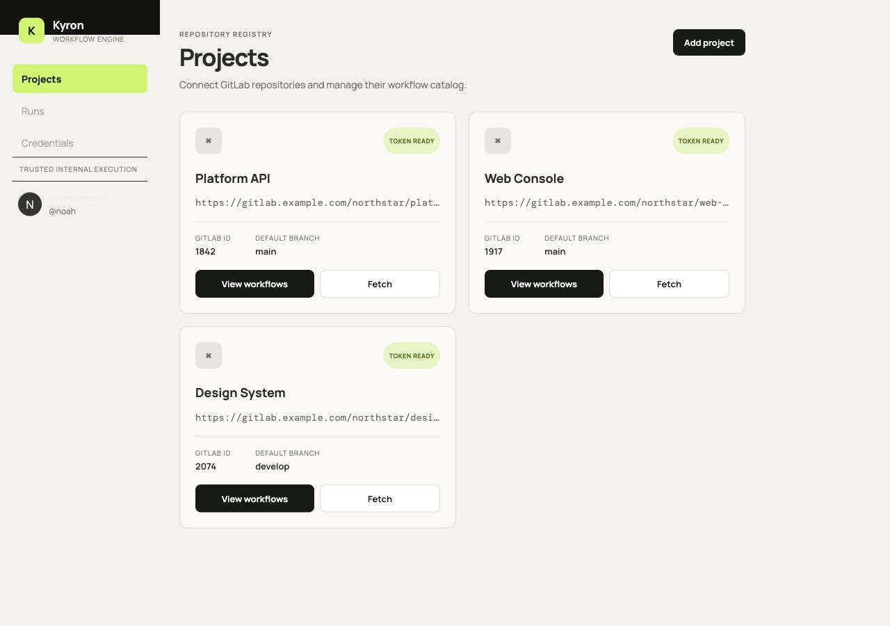
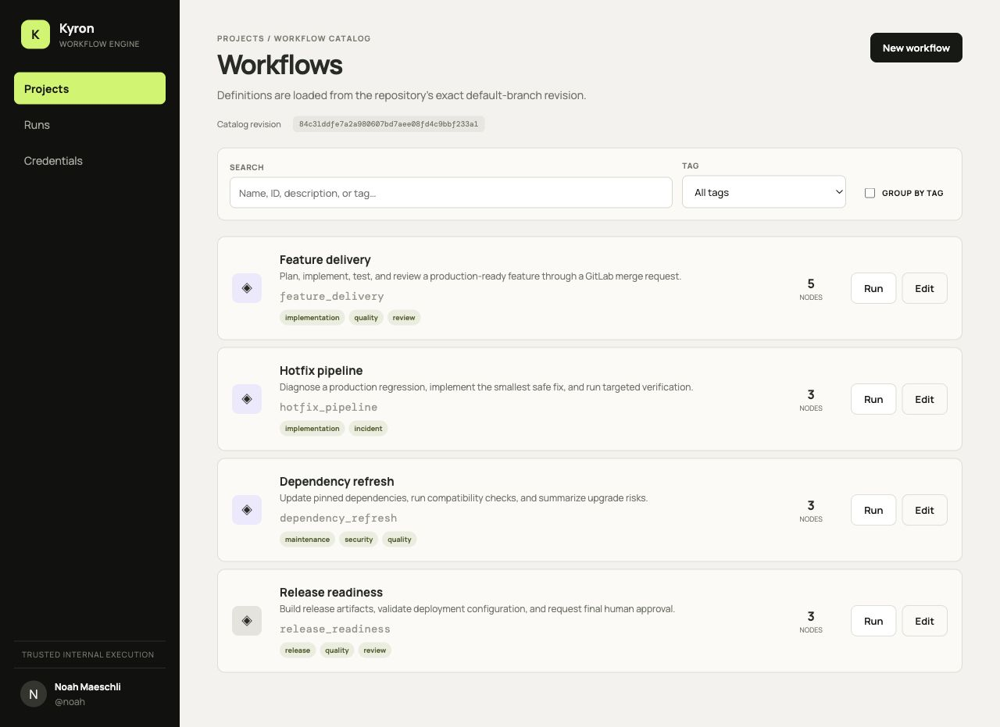
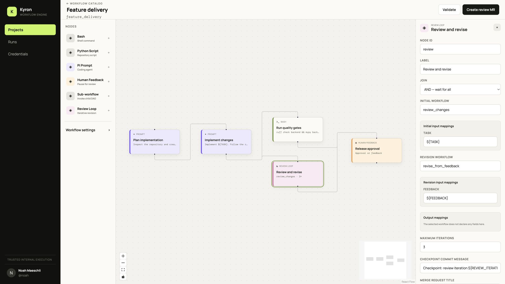
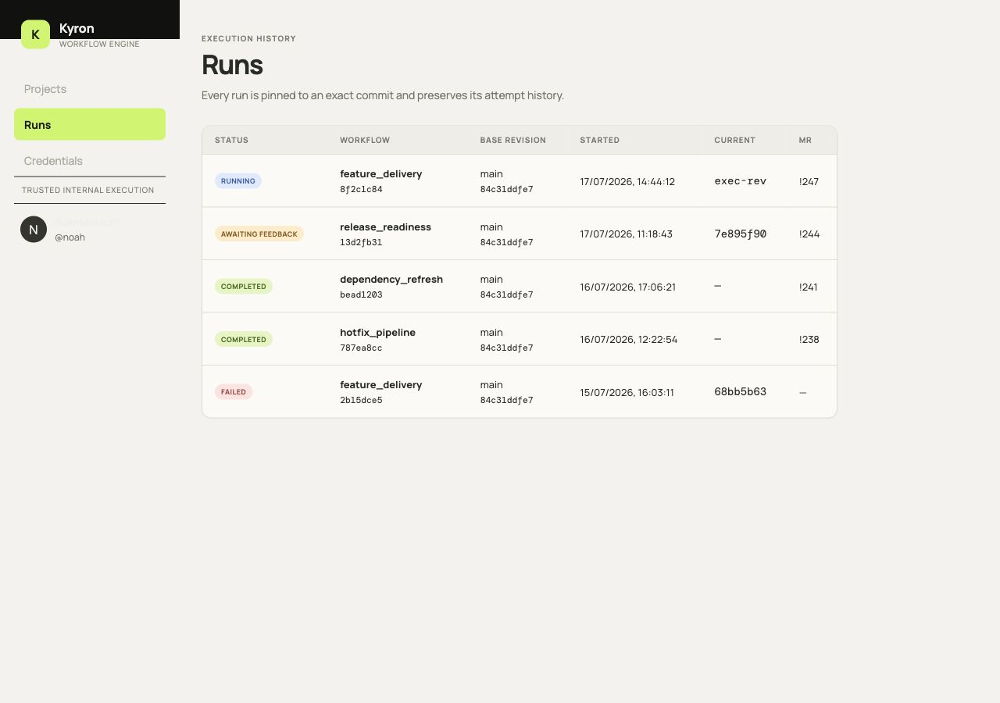
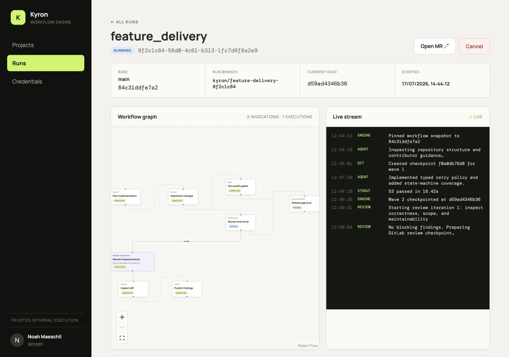

<div align="center">
  
  <br /><br />
  <a href="https://www.python.org/"></a>
  <a href="https://fastapi.tiangolo.com/"></a>
  <a href="https://react.dev/"></a>
  <a href="https://www.typescriptlang.org/"></a>
  <a href="https://www.postgresql.org/"></a>
  <a href="https://docs.docker.com/compose/"></a>
  <a href="LICENSE"></a>
  <p><strong>A self-hosted workflow engine for reviewable, recoverable AI-assisted software delivery.</strong></p>
  <p>
    <a href="#why-kyron">Why Kyron</a> ·
    <a href="#how-it-works">How it works</a> ·
    <a href="#quick-start">Quick start</a> ·
    <a href="#workflow-example">Workflow example</a> ·
    <a href="#documentation">Documentation</a> ·
    <a href="#license">License</a>
  </p>
</div>

---

Kyron orchestrates coding workflows against Git repositories and delivers their changes through GitLab merge requests. Every run is pinned to an exact commit, every parallel execution wave is checkpointed in Git, and every decision needed to recover or resume a run is persisted.

It is designed for trusted internal engineering teams that want the speed of coding agents without giving up review, reproducibility, or operational control.

> [!IMPORTANT]
> **Kyron is an orchestration engine, not a sandbox.** Bash, Python, and Pi prompt nodes execute directly in the backend environment. Run it only for trusted workflow authors and trusted repositories, behind the included OAuth boundary.

## Why Kyron

<table>
  <tr>
    <td width="33%" valign="top">
      <h3>Deterministic by design</h3>
      Workflows and every transitive child definition are loaded from one exact Git SHA and stored as an immutable run snapshot.
    </td>
    <td width="33%" valign="top">
      <h3>Git-native recovery</h3>
      Ready nodes run as a wave. A failed wave is reset as a whole and resumed with fresh attempt rows—without erasing history.
    </td>
    <td width="33%" valign="top">
      <h3>Human control built in</h3>
      GitLab merge requests, approval resets, feedback checkpoints, and review loops make human decisions part of the workflow.
    </td>
  </tr>
</table>

### Highlights

- **Visual workflow builder** for Bash, Python script, prompt, human-feedback, sub-workflow, and review-loop nodes.
- **Composable DAGs** with conditional edges, `AND`/`OR` joins, typed inputs, public variables, declared outputs, and reusable child workflows.
- **Durable execution history** covering invocations, waves, node executions, attempts, edge evaluations, feedback, and engine logs.
- **Live operations UI** with expanded run graphs, nested review iterations, WebSocket logs, Git checkpoint boundaries, and resume/cancel controls.
- **GitLab-native delivery** with OAuth identity, repository registration, workflow-definition review MRs, run MRs, and authenticated webhooks.
- **Secret-aware execution** with Fernet-encrypted credentials, just-in-time decryption, in-memory redaction, and write-only API values.
- **Recovery after interruption** through startup reconciliation, exact worktree state, immutable attempts, and explicit operator-driven resume.
- **Single-VM deployment** with Caddy, React, FastAPI, PostgreSQL, GitLab OAuth, and the Pi coding agent packaged in Docker Compose.

## How it works



1. A user triggers a merged workflow from a registered repository and selects a base ref.
2. Kyron resolves that ref to an exact SHA and snapshots the root workflow plus every transitive child from the same revision.
3. The engine creates an isolated branch and worktree, then schedules ready nodes in deterministic waves.
4. Successful waves become Git checkpoints. If one node fails, the whole wave rolls back before a new attempt can start.
5. Human-feedback and review-loop nodes pause execution behind GitLab MR review. Only the triggering GitLab user can continue the checkpoint.
6. Kyron persists the final state, commit, logs, attempts, and MR metadata for later inspection or recovery.

Workflow definitions live in the repository at `.workflowEngine/<workflow_id>.json`, so orchestration logic is versioned and reviewed alongside the code it changes.

## Interface

The React operator UI includes:

- a repository registry and searchable, tag-aware workflow catalog;
- a React Flow builder with a node palette, configuration inspector, validation feedback, and MR-based saves;
- run history pinned to base revisions and linked to delivery merge requests;
- expanded execution graphs for child workflows and every review-loop iteration;
- live engine/process output, human-feedback controls, execution waves, and attempt history.

### Product tour

<table>
  <tr>
    <td width="50%" valign="top">
      
      <br />
      <sub><strong>Projects.</strong> Register trusted GitLab repositories and see token and default-branch status at a glance.</sub>
    </td>
    <td width="50%" valign="top">
      
      <br />
      <sub><strong>Workflow catalog.</strong> Search merged definitions, filter by tags, and trigger or edit a workflow from its exact catalog revision.</sub>
    </td>
  </tr>
</table>

<p align="center">
  
  <br />
  <sub><strong>Visual builder.</strong> Compose typed nodes into a DAG and configure reusable sub-workflows, review loops, mappings, joins, and checkpoint behavior.</sub>
</p>

<table>
  <tr>
    <td width="40%" valign="top">
      
      <br />
      <sub><strong>Run history.</strong> Track status, workflow, immutable base revision, current execution, and delivery merge request.</sub>
    </td>
    <td width="60%" valign="top">
      
      <br />
      <sub><strong>Run detail.</strong> Inspect expanded child invocations, execution state, Git checkpoints, live logs, and merge-request controls in one view.</sub>
    </td>
  </tr>
</table>

> Screenshots were captured from the production frontend build against temporary local API fixtures. Production authentication is unchanged, and no demo mode or fixture data is included in the application.

## Quick start

### Prerequisites

- Docker Engine with Docker Compose v2
- a GitLab OAuth application with `read_user` access
- a GitLab project access token for each repository Kyron will manage
- a hostname that resolves to the machine running Kyron

### 1. Configure the environment

```bash
cp .env.example .env
```

Generate independent encryption and session-signing keys:

```bash
python3 -c "from cryptography.fernet import Fernet; print(Fernet.generate_key().decode())"
python3 -c "import secrets; print(secrets.token_urlsafe(48))"
```

Update `.env` with:

- `APP_HOST`, `APP_BASE_URL`, and the GitLab URL;
- OAuth client ID, secret, and the exact callback URL `${APP_BASE_URL}/auth/callback`;
- the generated Fernet and session-signing keys;
- webhook secrets; and
- the same database password in `POSTGRES_PASSWORD` and `DATABASE_URL`.

Never commit `.env`. Kyron intentionally refuses to start without it.

### 2. Validate and start the stack

```bash
docker compose -f deploy/docker-compose.yml config
docker compose -f deploy/docker-compose.yml up --build -d
```

Open the configured `APP_BASE_URL`. Caddy redirects the first request through GitLab OAuth, then serves the UI and authenticated API from the same origin.

```bash
# Follow the services
docker compose -f deploy/docker-compose.yml logs -f

# Stop the stack without deleting persistent volumes
docker compose -f deploy/docker-compose.yml down
```

> [!WARNING]
> Production must run exactly **one backend worker**. Expose only Caddy on ports 80/443; never publish the backend, auth service, or PostgreSQL directly.

For backup, restore, retention, failure handling, and release checks, follow the [operations runbook](docs/operations.md).

## Workflow example

Create `.workflowEngine/implement_and_test.json` in a registered repository:

```json
{
  "id": "implement_and_test",
  "name": "Implement and test",
  "description": "Ask the coding agent to implement a task, then run the test suite.",
  "version": 2,
  "created_by": "platform@example.com",
  "tags": ["implementation", "quality"],
  "inputs": {
    "TASK": {
      "type": "string",
      "required": true,
      "description": "The change to implement"
    }
  },
  "outputs": {},
  "variables": {},
  "nodes": [
    {
      "id": "implement",
      "type": "prompt",
      "label": "Implement the change",
      "join": "and",
      "config": {
        "prompt": "Implement this task in the current repository: ${TASK}",
        "allow_failure": false,
        "project_trust": "never"
      },
      "position": { "x": 100, "y": 120 }
    },
    {
      "id": "tests",
      "type": "bash",
      "label": "Run tests",
      "join": "and",
      "config": {
        "command": "pytest",
        "timeout": 900,
        "allow_failure": false,
        "shell": "/bin/bash"
      },
      "position": { "x": 430, "y": 120 }
    }
  ],
  "edges": [
    {
      "id": "implement_to_tests",
      "source": "implement",
      "target": "tests",
      "condition": null
    }
  ],
  "settings": {}
}
```

Merge the definition, refresh the workflow catalog, and trigger it with a `TASK` value. Kyron pins the selected base commit before queueing the run.

See the [workflow JSON authoring specification](docs/workflow-json-authoring-spec.md) for the full schema, built-in variables, conditions, composition, review loops, and validation rules.

## Development

Install and verify the backend:

```bash
python3 -m venv .venv
. .venv/bin/activate
python3 -m pip install -e '.[dev]'
ruff check backend
mypy backend
pytest
```

Install and verify the frontend and OAuth service:

```bash
npm --prefix frontend ci
npm --prefix frontend run check
npm --prefix frontend run build

npm --prefix auth-service ci
npm --prefix auth-service run check
npm --prefix auth-service run build
```

Run every available local release check with:

```bash
./scripts/verify.sh
```

State-machine changes must include tests. Preserve unrelated worktree changes, use argument arrays for Git and Pi processes, and validate every filesystem path against its configured root.

## Project status

Kyron is currently at **v0.1.0**. All eight implementation milestones are complete; acceptance scenarios that require a real GitLab instance, OAuth application, TLS hostname, and provider credentials remain deployment-specific checks.

See the [implementation plan](docs/IMPLEMENTATION_PLAN.md) and [acceptance checklist](docs/acceptance.md) for the detailed delivery record.

## Documentation

| Document | Purpose |
| --- | --- |
| [Workflow authoring specification](docs/workflow-json-authoring-spec.md) | Complete JSON contract for authors and LLMs |
| [Architecture](docs/architecture.md) | Runtime components, persistence, execution, and secret boundaries |
| [API guide](docs/api.md) | HTTP/WebSocket routes, authentication, and state conflicts |
| [Operations runbook](docs/operations.md) | Deployment, backup, restore, incidents, and retention |
| [Acceptance checklist](docs/acceptance.md) | Local evidence and target-environment validation |
| [Decision log](docs/decisions.md) | Architectural decisions and normative deviations |
| [Implementation plan](docs/IMPLEMENTATION_PLAN.md) | Milestone scope, status, and verification gates |
| [Normative engine specification](workflow_orchestration_engine_spec.md) | Authoritative product behavior and constraints |

## License

Kyron is source-available under the [PolyForm Noncommercial License 1.0.0](LICENSE). You may use, modify, and redistribute it for permitted noncommercial purposes, subject to the license terms and required notices.

Commercial use—including paid distribution, bundling, hosting, managed services, or use in revenue-generating business operations—requires a separate written license. See [commercial licensing](COMMERCIAL-LICENSE.md) for details.

Copyright © 2026 Noah Mäschli. All rights reserved except as expressly granted under the applicable license.

---

<div align="center">
  <sub>Built for teams that want agentic speed with Git-level accountability.</sub>
</div>
