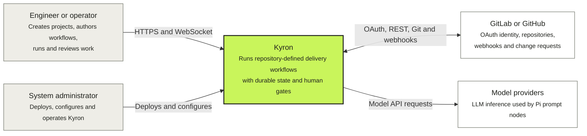

# Technical architecture

Kyron is a trusted-internal workflow orchestration system. Its supported production topology is one Linux VM running Docker Compose, with Caddy as the only public service and exactly one FastAPI worker owning orchestration. PostgreSQL is the durable source of execution truth; repository clones, worktrees, process output, and artifacts live on persistent storage.

These pages use the [C4 model](https://c4model.com/) for static structure and deployment diagrams plus sequence diagrams for behavior that changes over time. A C4 *container* is an independently executing application or data store; it does not necessarily correspond one-to-one with a Docker container.

## System context

Kyron trusts authenticated internal users, reviewed workflow authors, registered repositories, and the VM/container host. It is not a hostile multi-tenant sandbox. See the [security model](/deployment/security) for the exact trust boundary.

## Architecture views

| View | Question it answers |
| --- | --- |
| [Runtime containers](/architecture/containers) | Which applications and data stores make up Kyron, and how do requests cross them? |
| [Deployment topology](/architecture/deployment) | Which Docker processes, ports, images, and volumes run on the supported VM? |
| [Configuration and secret flow](/architecture/configuration-flow) | Where does configuration originate, which processes receive it, and how are node environments constructed? |
| [Backend components](/architecture/backend-components) | How does the FastAPI worker divide API, scheduling, execution, persistence, and provider responsibilities? |
| [Runtime sequences](/architecture/runtime-sequences) | How do startup, run execution, node attempts, feedback, and recovery unfold over time? |

The [workflow authoring documentation](/workflows/), [HTTP and WebSocket API](/api), and [run-state reference](/reference/states) define public behavior. The [decision log](/decisions) records accepted architectural choices. The root specification remains the normative product contract when a diagram and implementation description disagree.

## Architectural invariants

- Production runs exactly one backend container and one Uvicorn worker. Task ownership, process registries, and the run semaphore are in-process.
- A run resolves its code subject and executable workflow bundle to exact commits and stores a secret-free workflow snapshot before execution.
- Ordinary workflow graphs are acyclic. Repetition is explicit through `review_loop`.
- Ready process nodes run in checkpointed waves. A failed wave is reset as a whole and retried with new attempt rows.
- Mutable execution state is represented durably in PostgreSQL so interruption can be classified and recovered explicitly.
- Decrypted credentials exist only immediately before code-host or node-process use. They are never persisted, logged, or available as public `${...}` variables.
- Only identities captured by a gate's approval-policy snapshot may control that feedback checkpoint.
- Derived repository, worktree, and run-data paths remain beneath configured roots.

## Data ownership at a glance

| State | Owner | Durability |
| --- | --- | --- |
| Users, projects, encrypted credentials, workflow runs, attempts, gates and audit events | PostgreSQL | Durable source of truth |
| Repository clones and run worktrees | Backend-managed host data root | Durable while required by active or retained runs |
| Attempt logs, Pi events and artifacts | Backend-managed host data root | Durable according to retention policy |
| TLS certificates and Caddy runtime state | Caddy volumes | Durable deployment state |
| Run tasks, semaphores, process groups and live log subscribers | Single backend process | Ephemeral; reconciled against durable state |
| Pi agent directory, cache and temporary files | Per-attempt scratch directory | Ephemeral and removed after the attempt |

## Keeping the views current

Update the affected architecture view whenever a change modifies a deployable process, public/internal port, persistent store, environment-variable owner, trust boundary, run state transition, subprocess boundary, or external integration. Prefer one relationship per arrow, label it with protocol and purpose, and link detailed contracts instead of copying them into diagrams.
