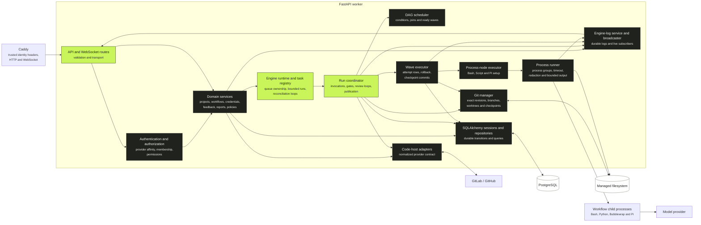

# Backend components

The workflow engine is one FastAPI/Uvicorn process. API handling, scheduling, execution, reconciliation, and live-log broadcasting share its event loop and process-local registries. PostgreSQL and the managed filesystem hold the evidence required to recover when that process disappears.

The diagram shows responsibility flow, not a strict call graph. A route may use several services and a service may open its own short-lived provider client or database session.

## API and domain boundary

FastAPI routes validate transport schemas and obtain a database session. Authentication dependencies parse only the identity headers normalized by the auth service and inserted by Caddy. Authorization combines a global system-administrator flag with project memberships, roles, and fixed server-recognized permissions.

Domain services own project registration, workflow discovery and snapshotting, credential encryption, approval policies, feedback, reports, cleanup, metrics, and provider configuration. Provider-specific shapes do not leak into these services: GitLab and GitHub adapters normalize repositories, users, comments, reviews, and change requests behind one contract.

Every project belongs to one provider, and an active session carries one provider identity. API boundaries reject cross-provider mutations.

## Execution ownership

The `EngineRuntime` owns:

- a task registry bounded by `MAX_CONCURRENT_RUNS`;
- queue reconciliation for durable `QUEUED` rows that lack an in-process task;
- resource reconciliation for cleanup, retention, orphan detection, storage thresholds, and missed provider events; and
- construction of the coordinator, Git manager, provider client, process runner, wave executor, and log services for each run task.

The run coordinator reconstructs the immutable workflow bundle and advances durable run, invocation, workspace, sub-workflow batch, review-loop, gate, and change-request state. The DAG scheduler evaluates edges and joins to determine which nodes are ready. Ready process nodes execute concurrently as one wave against the same invocation workspace.

Before a wave starts, Kyron records its start commit and creates new execution/attempt evidence. If any required node fails, sibling attempts are cancelled and the entire workspace is reset to the wave start. A retry creates fresh attempt rows; failed evidence is never overwritten. A successful wave becomes a Git checkpoint.

## Workspaces and exact revisions

Every run separates two pinned revisions:

| Revision | Meaning |
| --- | --- |
| Code subject | The exact commit whose repository content the run examines or changes |
| Workflow bundle | The exact trusted commit from which the root and every transitive workflow definition and credential policy were resolved |

Delivery runs normally use the same commit for both. Report-only runs may use a branch or change-request source commit as the code subject while loading executable workflow definitions from the trusted default branch or an authorized local snapshot. Terminal evidence records both revisions.

The root invocation owns a root branch and worktree. Shared child invocations use the nearest owning workspace. Isolated invocations fork child branches and worktrees from the parent's exact clean checkpoint. Isolated-parallel siblings can execute concurrently because they do not share filesystem, staging, or rollback state.

An isolated parallel batch freezes its parent workspace until all required children succeed. Successful child heads merge into the parent with explicit merge commits in stable parent-node-ID order. A conflict resets and cleans the parent back to the batch base, making the integration atomic from the scheduler's perspective.

## Durable and ephemeral state

PostgreSQL stores run, invocation, workspace, batch, execution, attempt, edge-evaluation, gate, feedback, provider-delivery, log, and audit rows. The immutable workflow snapshot plus these rows reconstruct the displayed graph; no visualization-only execution state is persisted.

The following state is intentionally process-local:

- active asyncio tasks and the run semaphore;
- registered process groups used for cancellation;
- per-project Git locks;
- live WebSocket subscribers; and
- decrypted credentials and output-redaction values.

Startup marks previously active execution interrupted, leaves durable feedback waits unchanged, and schedules queued work. Recovery is explicit rather than pretending an interrupted child process continued.

## Workflow and provider metadata

Workflow tags are versioned metadata inside repository YAML, not database state. Catalog filtering and child-workflow selection therefore describe the same default-branch revision returned by the workflow API. Tags do not affect execution.

The Pi provider registry is versioned, secret-free PostgreSQL state. A run snapshots the active document and revision when queued, so retries and review iterations keep the same endpoint routing. Credential-variable references are resolved independently for each attempt.

Approval policies are project database state referenced by stable workflow keys. Opening a gate snapshots the resolved rules and eligible provider identities, preventing later membership changes from rewriting an in-flight decision boundary. Decisions and authorization audit events are append-only.

Each isolated workspace owns at most one open workspace-review request targeting its immediate parent branch. The root final request is separate and targets the configured base ref. Only merge or close of that final request triggers whole-run resource cleanup.
