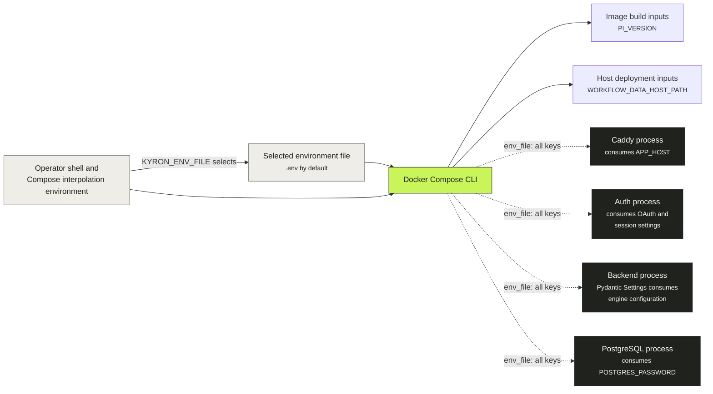
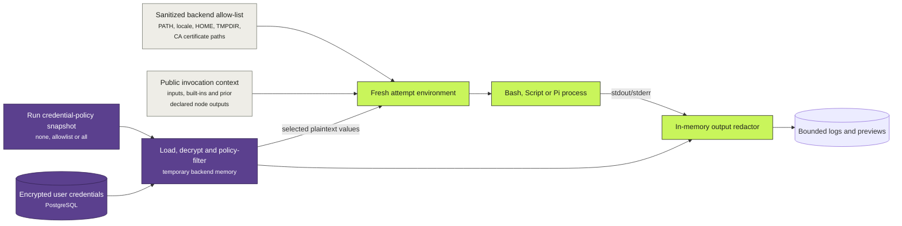

# Configuration and secret flow

Kyron has three distinct configuration planes. Deployment settings configure long-lived containers, public workflow context configures one run, and encrypted user credentials are released only for an authorized operation or node attempt. Keeping these planes separate prevents deployment secrets from becoming workflow inputs and prevents public `${...}` variables from resolving credential values.

## Deployment configuration

The repository `.env.example` is the authoritative production template. Docker Compose uses the selected file both for host-side interpolation and, through `env_file`, as the environment supplied to each service.

::: warning Injection is broader than consumption
The current Compose file supplies the same environment file to all four services. Every container therefore receives values it may not consume—for example, Caddy and PostgreSQL also receive OAuth and credential-encryption settings. The table below documents actual consumers, not the broader current injection. Treat narrower per-service injection as a future hardening change that must be made together with Compose validation and deployment documentation.
:::

### Compose-time inputs

These values affect deployment construction before a service process starts:

| Input | Source | Resolution | Result |
| --- | --- | --- | --- |
| `KYRON_ENV_FILE` | Operator shell or Compose interpolation environment | Compose configuration | Selects the required service `env_file`; defaults to `.env` |
| `PI_VERSION` | Selected environment/interpolation value | Backend image build | Pins the globally installed Pi coding-agent package; changing it requires an image rebuild |
| `WORKFLOW_DATA_HOST_PATH` | Selected environment/interpolation value | Compose configuration | Chooses the host directory bind-mounted to `/var/workflowengine` in the backend |
| `POSTGRES_USER`, `POSTGRES_DB` | Compose file literals | Container creation | Sets both values to `workflow_engine` for PostgreSQL |

`POSTGRES_PASSWORD` and the password embedded in `DATABASE_URL` must match, but they are consumed by different processes.

### Runtime consumers

This matrix identifies the process that reads each setting, regardless of the broader current `env_file` injection:

| Setting or group | Actual consumer | Purpose |
| --- | --- | --- |
| `APP_HOST` | Caddy | Public site address and TLS virtual host |
| `APP_ENV` | Backend and auth service | Production secret validation and secure-cookie behavior |
| `LOG_LEVEL` | Backend | Python application log level |
| `DATABASE_URL`, `DB_POOL_SIZE`, `DB_MAX_OVERFLOW` | Backend | SQLAlchemy connection and pool sizing |
| `POSTGRES_PASSWORD` | PostgreSQL | Database initialization and authentication |
| `CREDENTIALS_ENCRYPTION_KEY`, `CREDENTIALS_ENCRYPTION_KEY_VERSION` | Backend | Encrypt and decrypt stored user/project credentials |
| `GITLAB_URL` | Backend and auth service | Provider API/GitLab web origin and OAuth endpoints |
| `GITHUB_WEB_URL` | Auth service | GitHub/GHES OAuth and browser endpoints |
| `GITHUB_API_URL` | Backend and auth service | Provider integration and OAuth user lookup |
| `*_OAUTH_CLIENT_ID`, `*_OAUTH_CLIENT_SECRET`, `OAUTH_REDIRECT_URI` | Auth service | OAuth login and callback exchange |
| `SESSION_SIGNING_KEY`, `SESSION_PREVIOUS_SIGNING_KEY`, `SESSION_MAX_AGE_SECONDS` | Auth service | Signed browser-session creation, verification, lifetime, and rotation |
| `GITLAB_WEBHOOK_SECRET`, `GITLAB_WEBHOOK_SIGNING_SECRET`, `GITHUB_WEBHOOK_SECRET` | Backend | Authenticate provider webhook deliveries |
| `PROJECT_CLONE_BASE_PATH`, `WORKTREE_BASE_PATH`, `RUN_DATA_BASE_PATH` | Backend | Validated container paths for managed runtime storage |
| `WORKFLOW_DATA_HOST_PATH` | Docker Compose | Host side of the backend data-root bind mount |
| `PI_MODELS_CONFIG_PATH` | Backend | Optional provider-registry bootstrap/fallback file |
| `PI_VERSION` | Docker Compose/backend image build | Select the Pi package installed into the backend image |
| `MAX_*`, `PROCESS_*`, `QUEUE_*`, `STALE_*`, retention and usage-threshold settings | Backend | Execution caps, reconciliation cadence, cleanup, retention, and storage warnings |
| `AUTH_USER_TOUCH_INTERVAL_SECONDS`, `WORKFLOW_CATALOG_CACHE_TTL_SECONDS` | Backend | Durable identity-refresh throttling and workflow-catalog cache lifetime |

The React UI consumes no runtime environment settings. Vite builds a static same-origin bundle into the Caddy image.

See [configuration reference](/deployment/configuration) for every supported variable, default, and operational constraint.

## Workflow subprocess environment

The backend never passes its complete container environment to a workflow process. It constructs a fresh dictionary immediately before each Bash, Script, or Prompt attempt.

Construction order is significant:

1. Copy only `PATH`, locale values, `HOME`, `TMPDIR`, and supported CA-certificate variables from the backend environment when present.
2. Add the invocation's public context as strings.
3. Load credentials under the run's immutable effective policy and add only the released set. `none` loads nothing; `all` releases every credential. `allowlist` decrypts the user's rows into a temporary backend dictionary and then filters it before constructing the child environment.
4. For Prompt nodes, add Pi-specific ephemeral paths and `GIT_OPTIONAL_LOCKS=0`.
5. Launch the process with an argument array, register every secret value with the output redactor, and clear the in-memory environment and credential dictionaries after execution.

Public variables use `${NAME}` expansion in supported workflow fields and must exist in public context. Credentials are environment variables inside the child process, but deliberately cannot satisfy `${...}` templates.

## Prompt-node additions

Every Prompt attempt creates a new scratch root containing:

| Variable/path | Purpose | Lifetime |
| --- | --- | --- |
| `PI_CODING_AGENT_DIR` | Per-attempt Pi agent directory and staged `models.json` | Attempt only |
| `XDG_CACHE_HOME` | Per-attempt Pi/Node cache | Attempt only |
| `TMPDIR` | Per-attempt temporary directory | Attempt only |
| `PYTHONDONTWRITEBYTECODE=1` | Avoid Python bytecode writes outside intended output | Attempt only |
| `GIT_OPTIONAL_LOCKS=0` | Avoid optional Git lock writes by Pi inspection commands | Attempt only |

The active Pi provider document is secret-free and was snapshotted when the run was queued. The staged `models.json` contains credential-variable references rather than plaintext. Each required reference must exist in the run's released credentials before Pi starts.

Bubblewrap makes the container root recursively read-only and rebinds only the run worktree and attempt scratch root read-write. This is a filesystem write boundary, not a confidentiality boundary: Pi can read its environment and can access the network.

## Secret lifetimes

| Secret class | At rest | Plaintext location | End of lifetime |
| --- | --- | --- | --- |
| OAuth client secrets and session keys | Protected deployment environment file | Auth-service container environment/process memory | Container replacement or key rotation |
| PostgreSQL password | Protected deployment environment file and database connection configuration | PostgreSQL/backend environments and connection setup | Container replacement or rotation |
| Credential encryption key | Protected deployment environment file | Backend environment/process memory | Container replacement or rotation |
| User credentials | Fernet ciphertext in PostgreSQL | Backend memory and authorized child-process environment | Cleared after the operation/attempt; subprocess exit removes its environment |
| Code-host project token | Fernet ciphertext in PostgreSQL | Backend memory and the individual provider/Git operation | Discarded after that operation |

Plaintext values are registered with the streaming redactor before process output is persisted. This protects against accidental logging; trusted workflow code can still inspect any credential deliberately released to it.

## Change checklist

When adding or moving a setting:

1. Decide whether it is a Compose-time input, long-lived process setting, public workflow value, or encrypted credential.
2. Inject it only into the process that owns it where practical.
3. Add validation and a safe default or fail-fast requirement at the consumer boundary.
4. Update `.env.example`, the [configuration reference](/deployment/configuration), this ownership view, and deployment validation together.
5. Never use a deployment variable to bypass a failed durable workflow transition.
