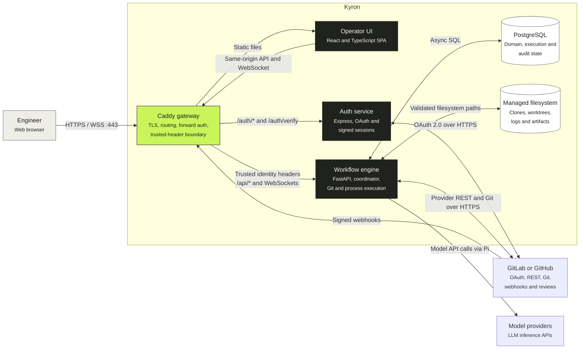

# Runtime containers

This C4 container view shows independently executing applications and data stores. The React application is a logical C4 container even though its production bundle is built into and served by the Caddy Docker image.

## Container catalog

| Container | Technology | Responsibility | Durable state |
| --- | --- | --- | --- |
| Caddy gateway | Caddy 2 | Terminates TLS, removes untrusted identity headers, performs forward authentication, proxies API/WebSocket traffic, and serves the SPA | Certificates and Caddy runtime data |
| Operator UI | React, TypeScript, Vite | Project administration, workflow authoring, run control, feedback, and live execution inspection | None in the application container |
| Auth service | Node.js, Express | GitLab/GitHub OAuth, signed browser sessions, provider-bound normalized identity headers | No server-side session store |
| Workflow engine | Python, FastAPI, SQLAlchemy, Alembic | API, authorization, snapshotting, scheduling, Git workspaces, process execution, recovery, retention, metrics, and provider integration | Uses PostgreSQL and the managed filesystem |
| PostgreSQL | PostgreSQL 16 | Durable domain, execution, authorization, provider-delivery, and audit state | `postgres_data` volume |
| Managed filesystem | Host bind mount | Cached clones, isolated worktrees, attempt output, Pi event logs, reports, and artifacts | Host data root, `/var/workflowengine` in the backend container |

## Request routing and identity

Caddy is the only public network boundary. Before routing, it removes every client-supplied `X-Token-*` identity header. Browser routes and ordinary `/api/*` requests are verified by the auth service. On successful API verification, Caddy copies the normalized provider identity headers returned by `/auth/verify` to the backend.

Three endpoint classes intentionally bypass browser OAuth:

| Route | Reason | Authentication |
| --- | --- | --- |
| `/api/health` | Container and operator health checks | No browser identity; returns bounded health state |
| `/api/webhook/gitlab` | GitLab event delivery | Project webhook token and optional project Standard Webhooks signature |
| `/api/webhook/github` | GitHub event delivery | Project HMAC secret over the raw body |

Backend, auth-service, and PostgreSQL ports are internal only. Direct access to the backend would bypass the trusted-header boundary and permit identity forgery.

## Runtime child processes

Bash, Script, and Prompt nodes are short-lived child processes of the workflow-engine container, not independently deployed C4 containers. Bash and Script nodes execute directly in the backend container. Prompt nodes launch Pi through Bubblewrap with a recursively read-only container root, a writable run worktree, writable per-attempt scratch state, and a private PID namespace.

The node environment is constructed explicitly rather than inherited wholesale from the backend. See [configuration and secret flow](/architecture/configuration-flow) for its provenance and [runtime sequences](/architecture/runtime-sequences) for the launch lifecycle.

## External systems

GitLab and GitHub implement one normalized code-host contract. Sessions and projects remain provider-bound, while provider-specific REST payloads and webhook shapes stay inside integration adapters. See the [provider architecture contract](/code-host-provider-spec).

Model endpoints are reached by the Pi process according to the provider registry snapshotted on the run. The registry is secret-free; its credential-variable references are resolved from the triggering user's encrypted credential store for each attempt.
