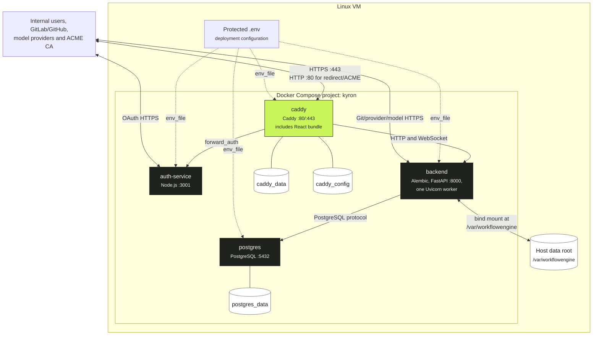
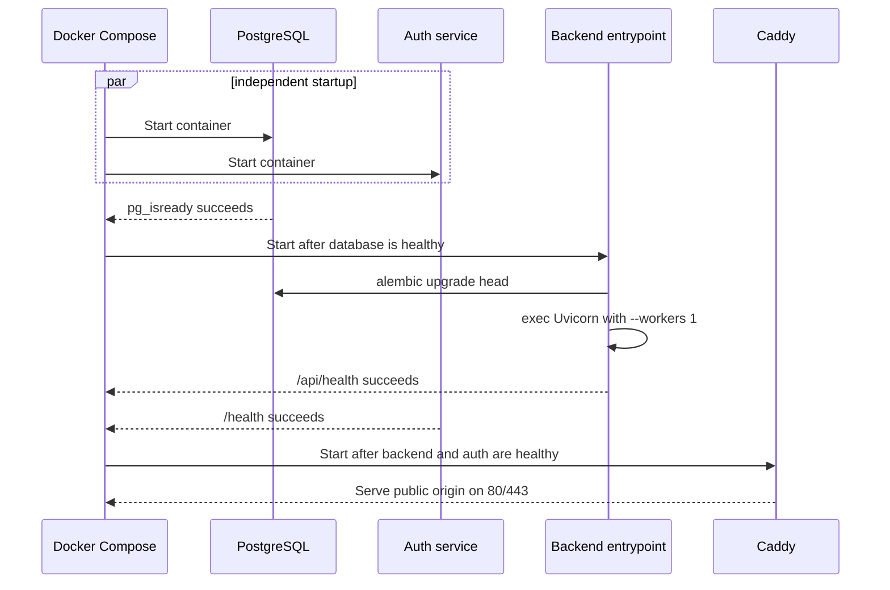

# Deployment topology

Kyron's supported production deployment is one Linux VM running the repository's Docker Compose stack. Only Caddy publishes host ports. The remaining services communicate through the Compose network and are not reachable directly from outside the host.

## Docker service mapping

| Compose service | Image | Host exposure | Internal endpoint | Persistent mounts |
| --- | --- | --- | --- | --- |
| `caddy` | Locally built multi-stage image | TCP 80 and 443 | Caddy listener | `caddy_data`, `caddy_config` |
| `auth-service` | Locally built Node image | None | `auth-service:3001` | None |
| `backend` | Locally built Python/Pi image | None | `backend:8000` | Host data root at `/var/workflowengine` |
| `postgres` | `postgres:16-alpine` | None | `postgres:5432` | `postgres_data` |

`expose` documents container ports but does not publish them on the host. Network controls must preserve this topology: a client that can reach the backend directly can forge the trusted headers normally established by Caddy.

## Image composition

| Image | Build behavior |
| --- | --- |
| Caddy | A Node build stage runs the Vite frontend build. The final Caddy image contains the static bundle at `/srv/frontend` and the repository Caddyfile. The frontend has no runtime environment-variable injection. |
| Auth service | A Node build stage compiles TypeScript and prunes development dependencies. The final image runs `node dist/server.js` as the unprivileged `node` user. |
| Backend | A Node stage installs the exact `PI_VERSION`; the final Python image adds Git, Bubblewrap, Curl, the backend package, and Alembic files. It runs as UID/GID `10001` with all capabilities dropped. |
| PostgreSQL | The upstream Alpine image initializes the `workflow_engine` database and stores it on its named volume. |

## Startup and health ordering

The backend startup lifecycle also validates runtime secrets, checks the active Pi provider configuration, marks previously active work interrupted, schedules queued runs, and starts queue/resource reconciliation loops.

::: danger Single-worker invariant
Do not scale the backend service, add Uvicorn workers, or enable reload in production. Run tasks, the concurrency semaphore, process ownership, and live registries are process-local. Multiple workers can claim and execute the same run.
:::

## Storage ownership

| Storage | Contents | Backup consideration |
| --- | --- | --- |
| `postgres_data` | Domain objects, encrypted credentials, run state, workflow snapshots, attempts, gates, audit records, Pi provider revisions | Back up consistently with encryption-key material stored through a separate secret channel |
| Host data root | Repository clones, run worktrees, attempt output, Pi events, reports and artifacts | Preserve paths and UID/GID ownership; retention differs by resource class |
| `caddy_data` | ACME account and certificates | Back up when certificate continuity matters |
| `caddy_config` | Caddy runtime configuration state | Back up with Caddy state when required by operations policy |

Repository clones may be reconstructed, but active worktrees and run data can contain required recovery evidence. Treat PostgreSQL and the backend data root as one recoverable system.

## Security-relevant runtime settings

The backend container drops all Linux capabilities and runs as UID/GID `10001`. Its seccomp profile is unconfined so Bubblewrap can create the namespaces and mounts used by Prompt nodes; the process still has no added capabilities. Operators must run the documented Bubblewrap preflight on the deployed host.

The VM needs outbound HTTPS to configured code hosts, model providers, registries, package sources, and an ACME certificate authority. Prompt nodes retain network access. See [production deployment](/deployment/) for the installation procedure and [security model](/deployment/security) for the exact guarantees and non-goals.
