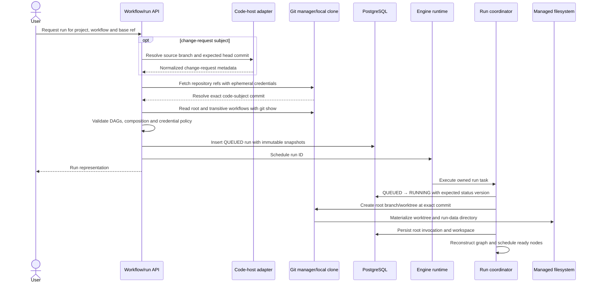
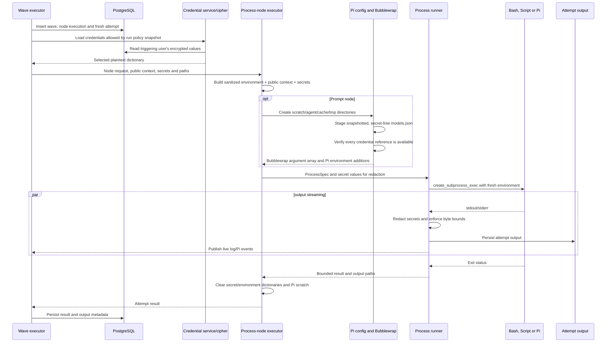
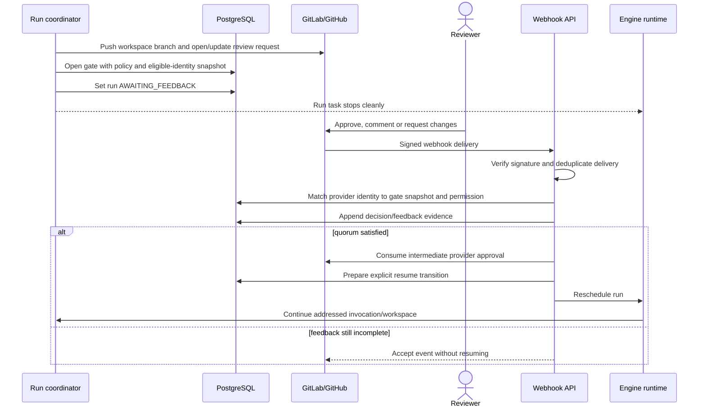
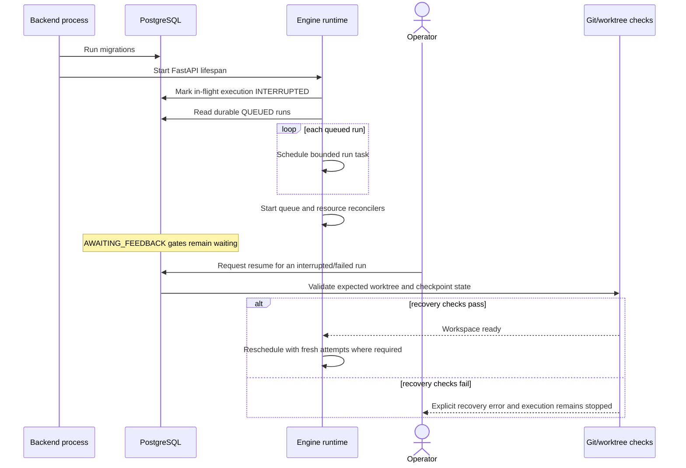

# Runtime sequences

C4 views describe stable structure. These sequences show when ownership and data change during the workflows most relevant to correctness and operations.

## Queue and initialize a run

The code subject and workflow-bundle revision are independent pins. Delivery runs normally select the same commit for both. Report-only runs can inspect an untrusted source commit while executing workflow definitions and credential policy from a trusted revision.

Run initialization uses a versioned durable transition before creating workspaces. If another owner already changed the row, initialization stops instead of duplicating execution.

## Execute one process-node attempt

The process runner registers the child's process group so cancellation can send `SIGTERM`, wait for the configured grace period, and escalate to `SIGKILL`. Secret redaction covers persisted and broadcast output but does not prevent trusted child code from reading credentials intentionally released in its environment.

All ready process nodes in one invocation execute concurrently as a wave. If any required attempt fails, Kyron cancels siblings, records every outcome, resets the worktree to the wave start commit, and fails the wave. Retrying creates new attempt rows.

## Pause and resume at a feedback gate

Only provider identities captured as eligible when the gate opened can control it, and project permission is checked again at the API boundary. Intermediate approval must be consumed before execution continues so it cannot also satisfy the final protected-branch requirement.

Workspace-review requests belong to isolated workspaces and target the immediate parent branch. This lets one child resume without advancing a sibling. The root final change request remains a separate lifecycle boundary.

## Backend restart and recovery

Kyron does not try to resurrect lost operating-system processes. Durable state records the interruption, while an operator-driven resume validates the current workspace against recorded checkpoints. Feedback waits remain unchanged because they represent durable external coordination rather than active worker ownership.

## Related contracts

- [Run states](/reference/states) defines permitted high-level transitions.
- [Edges, conditions, and joins](/workflows/edges-and-joins) defines DAG readiness.
- [Review loops](/workflows/review-loops) defines explicit repetition.
- [Failure and recovery](/guides/recovery) provides operator actions.
- [Security model](/deployment/security) defines subprocess and secret guarantees.
